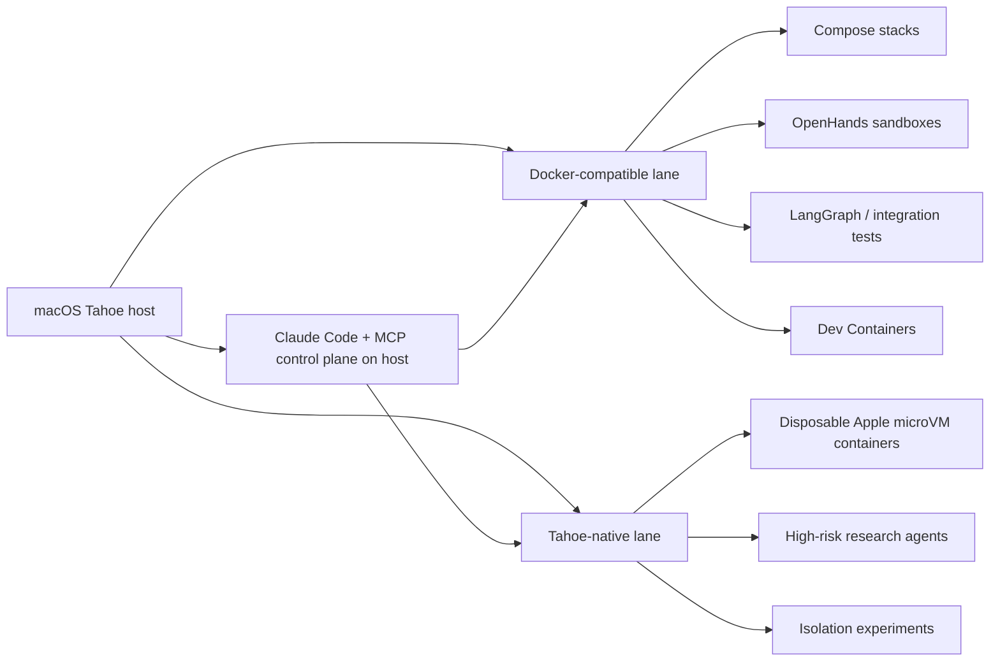

# macOS Tahoe zamiast Dockera dla Octadecimal

## TL;DR

- **Nie rekomenduję zastąpienia Dockera przez Tahoe-native jako jedynego runtime’u** dla Octadecimal na dziś. `container` od Apple jest architektonicznie ciekawy i bezpieczny, ale jego największa luka nie dotyczy CPU czy cold startu — dotyczy **ecosystem compatibility**: brak first-class `docker compose`, brak Docker Engine / Moby API, niedojrzały story dla Dev Containers i część ostrych krawędzi w bind mounts / networking. Dla projektu, który ma uruchamiać **multi-container, Claude-friendly agent stacks**, to są ograniczenia pierwszego rzędu. citeturn1view2turn38view0turn38view1turn38view2turn38view3turn38view4
- **Najlepsza decyzja dla Octadecimal: Hybrid** — **Docker-compatible runtime jako domyślna ścieżka** dla daily development i multi-container orchestration, a **Tahoe-native tylko dla wybranych, izolowanych microVM sandboxes** albo eksperymentów z agentami o wyższym ryzyku. To minimalizuje path dependency bez spalania kompatybilności z OpenHands, Dev Containers, Compose i standardowym toolingiem Claude Code. citeturn22view2turn22view3turn18view5turn38view0turn38view2
- **Claude Code / Claude Agent SDK, MCP servers, Cline i LangGraph mogą działać bez problemu na macOS host albo w Linux guests**, ale **OpenHands w praktyce dalej zakłada Docker sandbox jako lokalny default i rekomendację**. Jeśli OpenHands ma być realną częścią platformy, Tahoe-native nie jest dziś drop-in replacement. citeturn16view0turn16view1turn16view2turn22view2turn22view3turn28view5turn25view0turn25view4
- **Na MacBooku Pro M5 24 GB RAM największym ograniczeniem nie będzie sam model LLM, tylko lokalne execution sandboxes i I/O semantics.** Claude Agent SDK rekomenduje ~**1 GiB RAM / 1 CPU / 5 GiB disk per instance**, OpenHands lokalnie wymaga co najmniej **4 GB RAM**, a Apple `container` ma obecnie istotny limit: VM-y **nie oddają zwolnionej pamięci z powrotem do hosta** bez restartu kontenera. To faworyzuje ostre limity współbieżności i kolejkę worków zamiast „7 aktywnych teamów naraz”. citeturn18view0turn22view3turn1view2

_Wszystkie źródła zostały sprawdzone 2026-05-14. Materiały starsze niż 2025-09 oznaczam jako **[starsze]** w treści._

## Czym naprawdę jest Tahoe-native

Jeżeli przez „użycie macOS Tahoe zamiast Dockera” rozumieć **Apple Containerization + CLI `container`** z macOS 26 Tahoe, to najważniejszy fakt brzmi: **to nie są Linux containers współdzielące kernel macOS**. Apple uruchamia **lekki Linux VM dla każdego kontenera**, korzystając z **Virtualization.framework**, a na poziomie hosta używa także **vmnet**, **XPC**, **launchd**, **Keychain Services** i **Unified Logging**. Apple opisuje to wprost jako model „**one lightweight VM per container**”, z naciskiem na izolację, prywatność mountów i sub-second startup. To oznacza, że Tahoe-native jest **bardziej microVM-per-container** niż klasycznym engine’em typu Docker na Linuxie. citeturn1view2turn4view0turn29search1turn29search2turn29search3

Apple Virtualization.framework jest high-level API do uruchamiania **Linux i macOS guests**, a Hypervisor framework jest low-level API „**without third-party kernel extensions**”. To ma znaczenie dla bezpieczeństwa i dystrybucji: Apple’owy virtualization stack nie wymaga starego modelu KEXT-ów. Dla sieci Apple dokumentuje też `vmnet` i entitlements takie jak `com.apple.vm.networking`, co pokazuje, że networking jest częścią systemowego modelu, a nie ad hoc userland shimem. citeturn29search1turn29search2turn29search3turn29search11

W praktyce `container` ma już sensowny zestaw primitives: OCI images, `build`, `run`, `pull`, `push`, `network create`, `volume create`, `stats`, build-time `--secret`, port publish i publish Unix sockets. Apple pokazuje również build i run obrazów **multiplatform** (`arm64`, `amd64`) oraz uruchamianie `amd64` wariantu w Linux guest z użyciem **Rosetta**. To czyni Tahoe-native realnym narzędziem do codziennej pracy z obrazami OCI — ale nie jeszcze pełnym substytutem dojrzałego Docker ecosystem. citeturn5view0turn5view1turn6view1turn6view4turn40view0turn40view2

Najważniejszy niuans architektoniczny dla Octadecimal: Apple obiecuje niższy baseline resource usage niż „jeden duży shared VM”, bo gdy nic nie działa, nie są alokowane zasoby dla kontenerów. Jednocześnie Apple samo dokumentuje dziś istotne ograniczenie memory management: freed pages w guest Linux **nie są jeszcze realnie oddawane hostowi**; przy memory-heavy workloads trzeba okresowo restartować kontenery, żeby odzyskać RAM. Dla laptopa 24 GB to nie jest detal — to jest zasadniczy argument przeciw trzymaniu dużej liczby długotrwałych agent sandboxes na Tahoe-native bez własnej polityki recycling/restart. citeturn1view2

## Porównanie Tahoe-native z Docker-compatible runtime

Poniższa tabela jest syntetyczną oceną pod kątem **Octadecimal**: one-person software house, macOS host, TypeScript MCP servers, Python research agents, Claude Code i Docker-friendly multi-container local orchestration.

| Atrybut | Tahoe-native | Docker Desktop / colima / podman | Hybrid |
|---|---|---|---|
| **Execution model** | **Per-container lightweight VM**. Apple `container` odpala osobny Linux VM dla każdego kontenera. citeturn1view2turn4view0 | **Shared Linux VM** na hoście macOS; Docker Desktop uruchamia Docker Engine w lekkim Linux VM. Colima i Podman na macOS też wymagają Linux VM. citeturn11view1turn13view1turn12search2 | Docker-compatible kontroluje multi-container appy; Tahoe-native tylko tam, gdzie chcesz microVM isolation. |
| **Syscall / kernel compatibility** | W guest dostajesz Linux kernel i Linux primitives; publiczny kod Containerization pokazuje `cgroup2`, `ipc`, `mount`, `pid`, `uts` namespaces oraz overlay mount dla writable layer. **Nie znalazłem publicznego potwierdzenia szerokiego eBPF story** — to wymaga PoC. citeturn8view3 | Docker-compatible runtimes używają zwykłego Linux VM, więc ta kompatybilność jest lepiej przetarta przez ecosystem; Docker buildx i Linux-side tooling są dojrzalsze. citeturn10view3turn35search14 | Najbezpieczniej: kernel-sensitive rzeczy zostają w Docker-compatible lane, eksperymenty w Tahoe lane. |
| **Image model / layering / CoW** | OCI-compatible. Apple buduje obrazy z Dockerfile/Containerfile, zapisuje image filesystem jako block device z **EXT4**, a writable rootfs robi przez **overlay** w guest. citeturn4view0turn8view3turn40view0 | Docker na Linuxie standardowo używa `overlay2` / containerd image store; buildx ma bardziej rozwinięty cache ecosystem (`cache-from`, `cache-to`, registry/GHA/S3/AzBlob). citeturn35search14turn10view4turn35search11 | Buildy i cache w Docker-compatible; runtime isolation możesz selektywnie przenieść do Tahoe. |
| **File sharing / volumes** | Mountuje tylko potrzebne katalogi do konkretnego VM-a; to jest lepsze privacy-by-default. Ale publiczne issues pokazują jeszcze ostre krawędzie: cross-volume single-file mounts nie odbijają zmian na host, hard-linki w `virtiofs` mogą psuć single-file mounts, a pewne non-root create/write scenariusze na bind mounts kończą się `EACCES`. citeturn1view2turn5view2turn31search4turn31search2 | Docker Desktop dokumentuje, że bind-mounted katalogi zachowują oryginalne permissions hosta; plikowe sharing overhead istnieje, ale ecosystem jest dojrzalszy. Docker ma też **Synchronized file shares** dla dużych repozytoriów, choć to funkcja płatnych planów. citeturn11view2turn10view5turn11view3 | Host source tree i hot-reload w Docker-compatible; Tahoe-native raczej dla disposable sandboxes lub read-mostly workspaces. |
| **Networking / service discovery** | Apple daje custom networks (`container network create`) i dedykowane IP per container; jest też `--publish` i `--publish-socket`. Ale nie ma publicznie dojrzałej, Docker-style driver matrix ani first-class Compose story. Po restarcie systemu są zgłaszane problemy z reachability / hangami container ops. citeturn4view0turn6view1turn6view4turn37search0 | Docker Desktop dokumentuje standardowy model VM + NAT + port forwarding przez `com.docker.backend`, plus zarządzalne `docker network`. To jest bardziej przewidywalne dla lokalnych multi-service stacks i MCP over TCP. citeturn11view1 | Orkiestracja usług i MCP over TCP w Docker-compatible; Tahoe-native tylko jeśli topologia jest prosta. |
| **CLI / developer ergonomics** | `container` ma sensowny CLI, ale **brakuje compat layer**, na której opiera się wiele narzędzi: Apple zamknęło temat Docker Engine API jako **not planned**, Moby API też nie istnieje, a Compose pozostaje co najwyżej community/plugin story. VS Code Dev Containers ma tylko częściowe/eksperymentalne wsparcie. citeturn38view0turn38view1turn38view2turn38view3turn32search3 | Docker Desktop ma pełne `docker`/Compose/buildx/registry ergonomics. Colima daje Docker CLI compatibility, port forwarding, volume mounts, wiele instancji i opcjonalnie `vz` + Rosetta. Podman na macOS też działa przez VM, ale jego provider story bywa bardziej techniczne. citeturn14view3turn14view0turn13view1turn13view3 | Dwa runtime’y zwiększają cognitive load, ale pozwalają zachować pełny Docker UX tam, gdzie naprawdę jest potrzebny. |
| **Cross-arch** | Apple natywnie celuje w Apple silicon; można budować i uruchamiać `arm64` oraz `amd64` przez Rosetta w Linux guest. Nie widać dojrzałego publicznego story dla bardziej egzotycznych architektur. citeturn5view0turn32search9 | Docker buildx oficjalnie wspiera multi-platform przez QEMU, native nodes i cross-compilation. Colima ma `--vm-type=vz --vz-rosetta`. Docker VMM Beta **nie wspiera Rosetty**, więc przy `amd64` lepiej uważać na backend. citeturn10view3turn14view0turn11view0 | Build multi-arch w Docker-compatible; Tahoe-native zostaw głównie dla `arm64`. |
| **Observability** | Apple `container` integruje się z Unified Logging i ma `container stats`, ale nie ma publicznie porównywalnego control plane do Docker API ani natywnego OTEL story dla runtime’u. citeturn1view2turn40view0 | Docker ecosystem + agent frameworks mają dużo bogatsze hooks: Claude Code OTEL, OpenHands OTEL, Cline OTEL, LangGraph/LangSmith tracing. citeturn16view1turn22view1turn28view0turn28view3turn25view0 | Najbardziej praktyczne dla Octadecimal: runtime logs z Dockera, a agent telemetry z Claude/OpenHands/Cline/LangGraph. |
| **Security / isolation** | Najmocniejszy argument za Tahoe-native: **VM boundary per container**, mniejszy sharing host paths, integracja z Keychain, brak third-party KEXT-ów. citeturn1view2turn29search3 | Docker Desktop ma VM boundary, ale kontenery współdzielą ten sam Linux VM; ECI dodatkowo wzmacnia izolację przez user namespaces, choć strona docs jest **[starsza]** niż 2025-09. Podman ma rootless/rootful modele, ale na macOS i tak siedzi na VM. citeturn11view2turn13view1 | Najlepsze security posture przy zachowaniu ergonomii: trafiki/leaky agents do Tahoe lane, reszta do Docker lane. |
| **CI/CD parity z Linux prod** | Artefaktowo jest dobrze — OCI images są standardowe. Operacyjnie słabiej, bo lokalny runtime nie ma first-class Docker control plane i Compose semantics. citeturn1view2turn38view1 | Najbliżej realnego Linux prod: Dockerfile, Compose, buildx, registry cache, Agent Server images, Dev Containers. citeturn10view3turn10view4turn25view4turn18view5 | Najlepszy kompromis: parity dla większości ścieżek, bez zamykania drogi do Apple-native experiments. |
| **Licensing / support** | `apple/container` i `containerization` są open source, Apache-2.0. citeturn3search17 | Docker Desktop jest darmowy dla małych podmiotów; płatny wymóg dotyczy firm >250 pracowników lub >10 mln USD przychodu. Colima jest MIT. Podman jest Apache-2.0. citeturn35search2turn13view0turn39search1 | Finansowo sensowne: można wystartować od Docker Desktop, a potem zejść do Colima, zostawiając Tahoe-native jako lane eksperymentalny. |

### Ocena punktowa dla Octadecimal

To jest moja **opinionated synthesis**, nie deklaracja vendorów.

| Opcja | Performance | Compatibility with Claude Code | Developer ergonomics | Observability | Security | Resource efficiency |
|---|---:|---:|---:|---:|---:|---:|
| **Tahoe-native** | 4 | 2 | 2 | 3 | 5 | 3 |
| **Docker Desktop / colima / podman** | 4 | 5 | 5 | 4 | 4 | 4 |
| **Hybrid** | 4 | 5 | 3 | 4 | 5 | 3 |

Najważniejsza interpretacja tych liczb jest prosta: **Tahoe-native przegrywa dziś nie wydajnością, tylko orchestration surface area**. Dla Octadecimal to czynnik ważniejszy niż „czy startup trwa 0,2 s czy 0,9 s”. citeturn1view2turn11view0turn38view0turn38view2

## Kompatybilność z Claude Code i typowymi agentami

Dla **Claude Agent SDK** sytuacja jest dobra: Anthropic dokumentuje, że SDK działa w **Python i TypeScript**, bundluje natywny binary Claude Code dla platformy hosta, i dla produkcji rekomenduje **container-based sandboxing**; jako baseline per instance podaje około **1 GiB RAM, 5 GiB disk i 1 CPU**. To znaczy, że samo serce Octadecimal — TS MCP servers + Python agents + Claude Code hooks — **nie potrzebuje Dockera do uruchomienia jako takiego**. Może działać natywnie na macOS Tahoe albo w Linux guestach. Problem zaczyna się dopiero wtedy, gdy chcesz z tego zrobić **powtarzalny, wielosandboxowy local platform runtime**. citeturn16view0turn18view0

**Claude Code** ma dziś już dojrzałe primitives, które są ważniejsze dla Octadecimal niż sam runtime kontenerów: **MCP**, **managed permissions**, **sandboxing**, **OpenTelemetry**, polityki organizacyjne i dev containers. MCP daje zarówno klasyczne tool access, jak i możliwość pushowania zdarzeń do sesji; permissions są egzekwowane przez Claude Code, nie przez model; telemetry eksportuje metrics, logs i opcjonalne traces przez OTEL. To oznacza, że governance i observability powinieneś projektować przede wszystkim na warstwie **Claude Code / Agent SDK / twojego orchestratora**, a nie zakładać, że sam runtime kontenerów rozwiąże policy enforcement. citeturn16view1turn16view2turn18view2turn18view3turn18view4turn17search9

W praktyce **Cline** jest Tahoe-friendly, bo umie korzystać z **Claude Code subscription path** przez `claude` CLI, ma **Agent Teams**, rules/skills i telemetry przez OpenTelemetry. Jeśli więc chcesz mieć część agentów uruchamianą **natywnie na macOS host**, Cline i własne MCP servers nie są tu problemem. To dobra wiadomość dla lightweight coding assistants i części research workflows. citeturn28view5turn28view1turn28view0turn28view3turn28view4

Z kolei **OpenHands** jest dziś czytelnym kontrprzykładem. Dokumentacja mówi wprost, że **Docker sandbox jest defaultem i rekomendowaną opcją lokalną**, a setup na macOS zakłada **Docker Desktop**. OpenHands oczywiście ma też local/process i remote variants, ale cały „bezpieczny lokalny sandbox” oraz agent-server/workspace story są Docker-centric. Dla Octadecimal to ważne: jeśli chcesz realnie testować OpenHands obok Claude Code, to **Tahoe-native nie daje dziś tej samej klasy kompatybilności operacyjnej**. citeturn22view2turn22view3turn21search12turn22view5

**LangGraph** stoi pośrodku. Sam framework jest bardzo dobry dla governance-heavy orchestratora: ma **durable execution**, **persistence/checkpoints**, **human-in-the-loop**, fault-tolerance i deployment przez Docker / VM / Kubernetes. Ale to nie jest runtime zastępujący Docker na Macu; to warstwa orchestration logic. Innymi słowy: **LangGraph dobrze łączy się z Claude Code world**, ale nie rozwiązuje pytania „Tahoe vs Docker” — ono raczej zakłada, że i tak postawisz jakiś sensowny sandbox/runtime pod spodem. citeturn25view0turn25view1turn25view2turn25view4

## Wydajność i ryzyka operacyjne na M5 24 GB

Z perspektywy M5 24 GB najważniejsza obserwacja jest mało glamour: **na laptopie liczy się nie tylko throughput, ale memory discipline i file/network semantics**. Docker Desktop domyślnie przydziela Linux VM **50% pamięci hosta**, czyli na 24 GB daje to około **12 GB**, plus domyślny swap **1 GB**; Resource Saver może wyłączyć VM przy bezczynności, ale wznowienie trwa wtedy zwykle **3–10 s**. To daje przewidywalność, ale zjada stały kawałek budżetu pamięci, jeśli zostawisz ustawienia „as is”. citeturn11view3

Tahoe-native ma odwrotny profil. Apple twierdzi, że VM-y mają dynamiczniej zużywać pamięć i że przy braku uruchomionych kontenerów nie ma alokacji zasobów. To wygląda bardzo dobrze dla bursty, krótkich, izolowanych zadań. Jednak ten plus jest dziś osłabiony przez oficjalnie udokumentowany brak pełnego memory ballooning/reclaim: guest może zwolnić RAM „u siebie”, ale host go realnie nie odzyskuje bez restartu kontenera. Dla długich sesji agentów, które chwilowo rozrastają się przez dependency install, testy lub indeksację repozytorium, to jest realne ryzyko memory creep. citeturn1view2

Moja praktyczna estymacja dla **24 GB RAM** jest taka. Dla **lightweight Claude Agent SDK / własnych TS-Python agents** traktuj **1–1,5 GB RAM** jako realistyczny budżet na jednego aktywnie pracującego execute-heavy workera, bo Anthropicowe 1 GiB to sensowny baseline, a nie twardy ceiling. Dla **OpenHands-class heavier sandboxes** licz raczej **2–4 GB na aktywną jednostkę**, bo sam produkt rekomenduje minimum 4 GB dla lokalnego uruchomienia i ma Docker workspace overhead. Z tej perspektywy **7 logicznych teamów** możesz modelować bez problemu, ale **7 aktywnych sandboxów równocześnie** na 24 GB to zły pomysł; rozsądny laptopowy scheduler powinien trzymać **3–5 hot executors** i resztę w stanie queued / dormant. To jest wniosek inferencyjny z dokumentacji Anthropic i OpenHands, a nie oficjalna liczba vendorów. citeturn18view0turn22view3

W development workflow różnica będzie najbardziej widoczna przy **hot-reload, bind mounts i incremental builds**. Docker Desktop ma znane overheady file-sharing, ale dokumentuje je i oferuje mechanizmy typu **Synchronized file shares** dla dużych repozytoriów. Apple `container` jest bardziej prywatny w modelu mountów, ale publiczne issues w 2026 pokazują nadal kłopoty z edge-case’ami bind mounts i network state po restarcie systemu. Dla one-person shopu ważniejsze od „maksymalnego benchmarku” jest to, czy `pnpm dev`, `pytest -f`, watchers, symlinks i generated files działają przewidywalnie dzień w dzień. Dziś większą pewność daje tu nadal Docker-compatible lane. citeturn10view5turn11view3turn31search2turn31search4turn37search0

## Rekomendacja i plan PoC

### Rekomendacja końcowa

**Wybór dla Octadecimal: Hybrid.**

Nie dlatego, że „wszystko zależy”. Wręcz przeciwnie. **Nie używałbym Tahoe-native jako głównego lokalnego runtime’u dla całej platformy agentowej**, bo za dużo współczesnego tooling’u zakłada Docker API / Compose / Dev Containers / standardowe Docker network semantics. Ale **użyłbym Tahoe-native jako drugiego, wyspecjalizowanego toru**: do izolowanych, disposable sandboxes, zadań wyższego ryzyka i eksperymentów z per-agent microVM isolation. To daje Ci opcjonalność bez psucia codziennej produktywności. citeturn38view0turn38view1turn38view2turn22view2turn18view5

### Kiedy wybrać którą opcję

| Opcja | Kiedy wybrać | Największy trade-off | Jak ograniczyć ryzyko |
|---|---|---|---|
| **Use Tahoe-native** | Gdy masz mało usług, głównie `arm64`, nie potrzebujesz Compose/Moby API/Dev Containers i priorytetem jest per-container VM isolation. | Ekosystem i ergonomia. Nie performance. citeturn38view0turn38view1turn38view2 | Ogranicz scope do pojedynczych sandboxes; unikaj krytycznych bind mounts; nie zakładaj 7 hot workers; restartuj memory-heavy VMs rotacyjnie. citeturn1view2turn31search2turn31search4 |
| **Use Docker Desktop / colima / podman** | Gdy potrzebujesz kompatybilności z OpenHands, Compose, buildx, Dev Containers, CI parity i większością gotowych narzędzi. | Stały VM overhead i słabsza izolacja niż 1-VM-per-container. citeturn11view1turn11view3turn22view2 | Na start: Docker Desktop dla najszerszej kompatybilności; później ewentualnie Colima, jeśli zechcesz obniżyć koszt/footprint. Uważaj na Docker VMM Beta przy `amd64` i certain DB workloads. citeturn11view0turn14view0turn14view3 |
| **Hybrid** | Gdy chcesz zachować state-of-the-practice developer UX i jednocześnie badać Apple-native isolation bez stawiania firmy na niedojrzałym control plane. | Dwa runtime’y = większa złożoność operacyjna i port/resource collisions. | Oddziel odpowiedzialności: host/Claude control plane + Docker lane dla stacks + Tahoe lane tylko dla eksperymentów. Wprowadź jasne conventions dla portów, volume roots i telemetry tags. |

### Konkretny plan PoC dla Octadecimal

**Faza pierwsza — baseline Docker-compatible**

1. Postaw **Docker Desktop** jako baseline referencyjny, nie dlatego że „najlepszy na zawsze”, ale dlatego że to najszerszy compatibility target dla OpenHands i Dev Containers na macOS. Jeżeli `amd64` obrazy są krytyczne, nie zaczynaj od Docker VMM Beta, tylko od backendu o bardziej zachowawczej kompatybilności. citeturn22view3turn11view0
2. Uruchom lokalnie:
   - **Claude Agent SDK** w TypeScript i Python,
   - **MCP servers** w TS na hoście i w kontenerze,
   - **OpenHands** z Docker sandbox,
   - prosty **LangGraph** workflow z persistence,
   - jeden stack w **Dev Container** z Claude Code. citeturn18view0turn16view2turn22view2turn25view2turn18view5
3. Włącz telemetry: **Claude Code OTEL**, **OpenHands OTEL**, ewentualnie **Cline OTEL** i trace’y LangSmith/LangGraph. To od razu pokaże, czy twoje escalation flows i inter-agent comms są obserwowalne wystarczająco dobrze. citeturn16view1turn22view1turn28view0turn25view0

**Faza druga — Tahoe lane**

1. Weź **jeden** izolowany workload i przenieś go na Apple `container`: najlepiej coś prostego, `arm64`, bez Compose, z małą liczbą mountów.
2. Sprawdź:
   - `container build` dla twojego TypeScript MCP server,
   - `container run` z bind mount do repo,
   - multi-arch build (`arm64` + `amd64`) i uruchomienie `amd64`,
   - `container network create` + połączenie host ↔ guest ↔ guest,
   - `--publish-socket` dla lokalnych Unix sockets, jeśli planujesz IPC/MCP w ten sposób. citeturn5view0turn6view1turn6view4turn40view0turn40view2
3. Nie próbuj od razu odtwarzać Docker Compose. To jest właśnie obszar, w którym Apple lane jest dziś najsłabszy. citeturn38view3turn38view4turn38view0

**Faza trzecia — decyzja strategiczna**

Jeżeli po 2–3 tygodniach logi pokażą, że Tahoe lane jest stabilny dla twoich najbardziej nieufnych agentów, możesz go zostawić jako **execution substrate dla high-risk tasks**. Jeżeli nie — nic nie tracisz: główny workflow i tak już siedzi na kompatybilnym torze.

### Konkretna checklista PoC

- **Claude Agent SDK**
  - TS i Python start time
  - peak RSS per agent
  - success ratio komend Bash / file edits
  - OTEL end-to-end export działa / nie działa
  - threshold: brak swap thrash przy 3 równoczesnych agentach. citeturn18view0turn16view1

- **OpenHands**
  - local GUI start
  - sandbox spin-up latency
  - mount repo do `/workspace`
  - trwałość zmian po stop/start
  - threshold: stabilne 2 równoległe sandboxes przez 60 minut. citeturn22view2turn22view3turn21search11

- **LangGraph**
  - checkpoint persistence
  - resume po sztucznym killu procesu
  - human-in-the-loop interrupt/resume
  - threshold: zero utraty stanu po kill -9 orchestration process. citeturn25view1turn25view2

- **Tahoe-native Apple `container`**
  - bind mount correctness dla symlinków, generated files, chmod/chown
  - port publish i publish-socket
  - network reachability po restart/wake
  - multi-arch run (`arm64`, `amd64`)
  - threshold: brak nieodtwarzalnych `EACCES` i brak hangs po restarcie hosta. citeturn31search2turn31search4turn37search0turn5view0

- **Developer workflow**
  - `pnpm dev` / `vite` / `pytest -f` / watchers
  - incremental build times
  - repo bind mount latency
  - threshold: hot-reload w subiektywnie „codziennie akceptowalnym” czasie, bez ręcznych workaroundów. citeturn10view5turn11view3

## Otwarte pytania i ograniczenia

Najważniejsze rzeczy, których **nie udało się potwierdzić z wysoką pewnością wyłącznie z publicznych źródeł**, są następujące.

Po pierwsze, **eBPF story w Tahoe-native**. Publiczny kod i docs Apple pokazują `cgroup2` oraz klasyczne namespaces, ale nie znalazłem równie jednoznacznej, aktualnej dokumentacji dla eBPF-heavy lokals. Jeśli którykolwiek agent lub observability stack będzie polegał na eBPF, trzeba to sprawdzić ręcznie w PoC. citeturn8view3

Po drugie, **pełna zgodność Dev Containers / VS Code Remote Containers z Apple `container`**. W publicznych dyskusjach widać eksperymentalne attach flows, ale nie widać dojrzałego, first-class replacementu dla „Docker everywhere” w całym UX. To jest szczególnie ważne, jeśli Claude Code ma żyć wewnątrz dev containers jako codzienny workflow. citeturn38view2turn18view5

Po trzecie, **długie sesje po sleep/restart na laptopie**. Mam twarde publiczne sygnały o problemach Apple `container` po restarcie systemu oraz o braku restart policy/auto-start semantics, ale nie mam równie dobrego, obecnego benchmarku „8 godzin pracy z wieloma agentami na MacBooku, sleep/wake kilka razy dziennie”. To trzeba potraktować jako obowiązkowy soak test przed większą migracją. citeturn37search0turn36search15

Po czwarte, **realna przewaga performance Tahoe-native nad Docker-compatible w typowym coding-agent workflow**. Apple twierdzi „sub-second start” i mniejszy shared-VM overhead, Docker twierdzi bardzo mocne I/O w swoim Docker VMM, ale publiczne benchmarki między Apple `container` a Docker Desktop nadal są raczej rozproszone i niespójne niż kanoniczne. Dla Octadecimal ważniejsze są więc dziś powtarzalność i compatibility niż pogoń za benchmark headline. citeturn4view0turn11view0

**Bottom line:** dla Octadecimal pytanie nie brzmi „czy Tahoe jest interesujące?”. Brzmi „czy Tahoe może dziś przejąć rolę Dockera jako fundament lokalnej, wieloagentowej platformy developerskiej?”. Moja odpowiedź brzmi: **nie jako jedyny fundament, tak jako wyspecjalizowany drugi tor**. To jest wystarczająco ostrożne operacyjnie i wystarczająco ambitne architektonicznie.